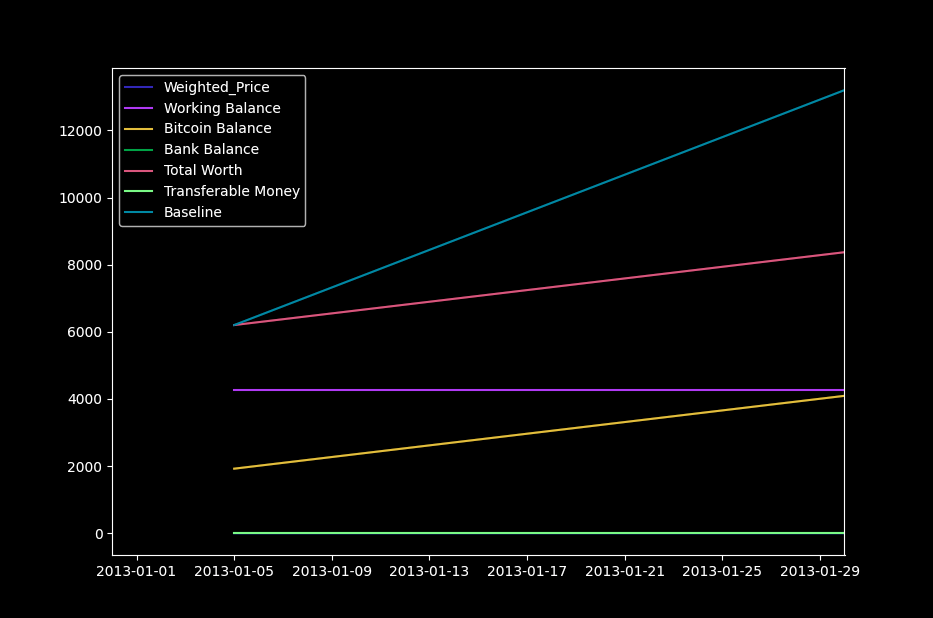

# Trading Agent

This project is one of my first ML projects. It's a bit broken at the moment.

When it is working, one  can see whatthe bot is thinking with the moving plot below

## Setup ##
1. Download bitcoin data from:
https://www.kaggle.com/mczielinski/bitcoin-historical-data

2. Download Glove embeddings from: https://nlp.stanford.edu/projects/glove/

3. Download twitter sentiment data: https://www.kaggle.com/c/twitter-sentiment-analysis2

4. Rename twitter sentiment data to Sentiment_Analysis_Dataset.csv or rename import line in SentimentModel.py

5. Train Sentiment model by running SentimentModel.py

6. Run TwitterScrape.py to grad some tweets

7. Run TwitterAnalysis.py to get the sentiment model's inferences

8. Run DataAnalysis.py to get the data needed to run the reinforcement learning agent

9. Train the TradingAgent by running TradingAgent.py

